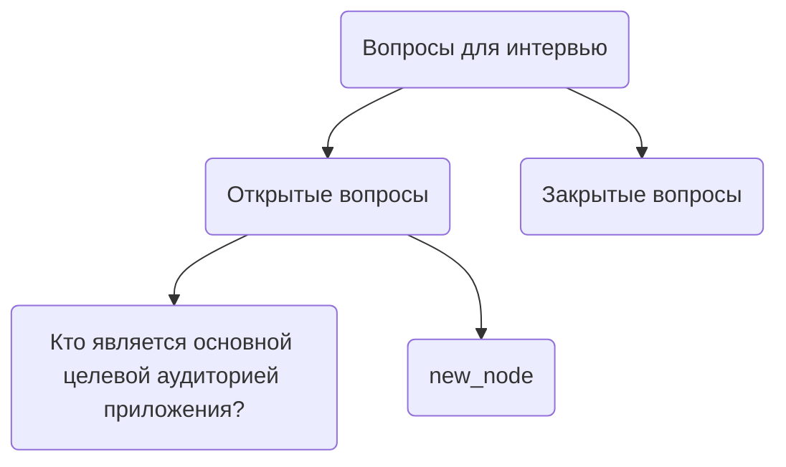

# Интервью

```mermaid

flowchart TB
  node_1("Вопросы для интервью")
  node_2("Открытые вопросы")
  node_3("Закрытые вопросы")
  node_4("Кто является основной целевой аудиторией приложения?")
  node_5("new_node")
  node_1 --> node_2
  node_1 --> node_3
  node_2 --> node_4
  node_2 --> node_5

```